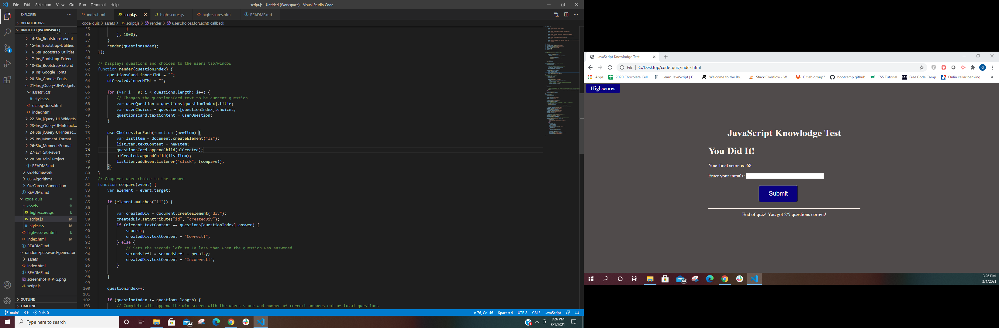

# code-quiz

This program is a simple JavaScript knowlodge test that asks the user a series of questions and gives a multiple choice list of answers for the user to answer with by click. The program uses two HTML JavaScript pages that are activated through the use of the game and checking locally stored high scores. 

### Usage

To begin the game the user should read the instructions and then click the start test button. A 100 second timer starts, and the user is presented with a question that must be answered through clicking on one of the answers. If answered correctly the user is told that the answer was correct and then the next question is displayed. If the user answers incorrectly 10 seconds is decucted from the reaming time, the user is told the answer is incorrect, and the next question is presented. after all of the questions are answered or the time runs out the user is presented with their score(the time remaining when the game ends) and the number of questions answered correctly out of the toal number of questions. The user is then asked to input their initials so that their score can be stored locally. User high scores can be viewed by clicking the High Scores link at the top left of the webpage. High scores can be cleared by clicking the clear scores button. 

### Installation 

Installation: There is no instillation for this program as it is a website. If you would like to access the website visit: 
https://gpphelps.github.io/code-quiz/

### Contributing 

If you would like to contribute in any way to this project please feel free to post an issue to the Github repository and I will address it as quickly as possible.

### Features
The code quiz uses the use of dynamic variables so that if a new question is added or questions are removed the total ammount of time for the game and the user displays will change to reflect the new number of questions. This webapge also features the use of localy stored data that allows the user to compete against their friends or classmates. 

### Credits

License: 2021 Gene Phelps II
